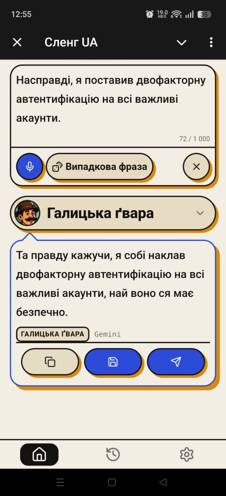
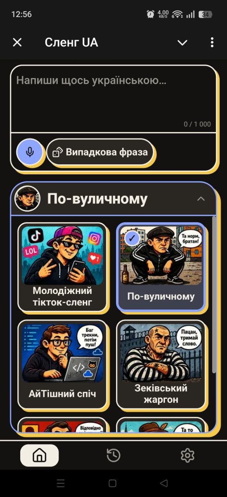
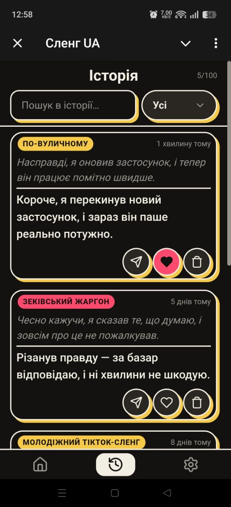

<div align="center">

# SlangUA


**One text - six Ukrainian registers.**

SlangUA is an AI translator between registers of the Ukrainian language. It turns ordinary Ukrainian text into six contrasting styles of speech, trying to keep the meaning and to change the style as far as it will go.

[](https://github.com/AlexToster/SlangUA/actions/workflows/ci.yml)
[](LICENSE)
[](package.json)
[](tsconfig.json)
[](https://t.me/SlangUA_bot)
[](plans/ROADMAP.md)

[Українською](README.md) · **English**

### [🚀 Try it in Telegram](https://t.me/SlangUA_bot) · [🎬 Demo](#demo) · [🎨 Styles](#styles) · [📚 Documentation](plans/docs/README.md)

</div>

## Demo

<div align="center">

🖼 An example of what it does


</div>

| Translation | Style picker | History |
| :---------: | :----------: | :-----: |
|  |  |  |

What one and the same text looks like in different styles. The output is Ukrainian — that is the entire point of the product — so it is quoted verbatim below, with a note on what each style did to it:

> **Original:** «Взагалі, кіт розбудив мене о шостій ранку і вимагав їсти»
> — "Actually, the cat woke me up at six in the morning and demanded food".

| Style | Result | What the style did to it |
| ----- | ------ | ------------------------ |
| **GEN_Z** — TikTok/Instagram slang | «Кіт - чиста база, розбудив о шостій і почав рофлити, вимагаючи їжу, повний крінж» | Borrowings from internet English are declined as Ukrainian verbs and nouns — *рофлити* from "to rofl", *крінж*, *база* as a marker of approval — and the cat's behaviour is re-framed as content. |
| **STREET** — the way the street talks | «Короче, кіт підняв о шостій ранку і вимагав жратву, труба повна» | Opens on a filler (*короче*), swaps the neutral *їсти* for *жратву*, and closes on a verdict the original never passed. |
| **IT_SLANG** — an engineer's speech | «Продакшн розбудив о шостій ранку і вимагав хотфікс їжі» | The situation itself is recast as an incident: the cat becomes *продакшн*, the food a *хотфікс*. Nothing but the frame of reference changes. |
| **KANCLER** — Soviet-era bureaucratese | «Беручи до уваги вищезазначені обставини та відповідно до встановленого внутрішнього розпорядку, повідомляємо наступне: суб'єкт (кіт) здійснив несанкціоноване втручання в процес нічного відпочинку вищезазначеної особи о шостій годині нуль-нуль хвилин ранкової доби з метою висування вимог щодо забезпечення виконання робіт із першочергового харчового забезпечення, що підлягає негайному розгляду та вирішенню згідно з чинним регламентом.» | Inflation, not addition: the meaning is identical, but the cat becomes *суб'єкт (кіт)*, six o'clock becomes *о шостій годині нуль-нуль хвилин*, and waking up becomes *несанкціоноване втручання в процес нічного відпочинку*. |
| **POFENI** — prison jargon, 18+ | «Кіт підняв о шостій ранку зі шконки і вимагав пайку» | The register comes from an institution rather than from the street: the bed is a *шконка*, the food a *пайка*. |
| **GALICIAN** — the Galician dialect | «Ай, прошу пана, кіт мя розбудив о шостій рано й фест хотів їсти» | Dialect grammar, not just vocabulary: the enclitic *мя* in place of *мене*, *фест* as an intensifier, *прошу пана* as an opener. |

The remaining styles, with examples of their own, are in the [Styles](#styles) table.

> **An honest word on the state of it:** the MVP works, and I am still experimenting with
> the Style Engine. Output quality depends on the LLM behind it — a local 7B model will
> give a weaker result than something in GPT-4's class. Where the project stands by
> stage is in [Status](#status).

## What this is

SlangUA is an **AI style translator** — not a dictionary, not a chatbot, not a text generator and not a machine translator. It takes your text and rewrites it in another register:

> Meaning is the priority. Style, as contrasting as it will go.

The goal of the project is to demonstrate how AI handles Ukrainian context — its humour,
its dialects and the social markers of speech. Behind that sits a question more
interesting than the translation itself: can a model hold on to Ukrainian context —
humour, dialect, social register — where a generic "rewrite it as slang" usually returns
a calque from English. So every style carries its own lexicon, prompt, examples and
"character personality", and the styles are deliberately contrasting with one another:
the result has to be recognisable from its first line, with no label saying which style
produced it.

The difference between them is not only lexical. **KANCLER** inflates phrasing two- to
fourfold. **POFENI** speaks through prison hierarchy and its «поняття» ("the code") —
a different layer from **STREET** (the yard, the street), while **GALICIAN** holds to
the Lviv ґвара rather than to a generic "western accent".

Technically: [how the Style Engine is built](plans/docs/07-styles.md) (in Ukrainian).

## Styles

Six styles. The identifiers are the values of the `SlangStyle` enum.

| Style | Voice | How it sounds |
| ----- | ----- | ------------- |
| `GEN_Z` | TikTok, Instagram, Discord | «Сквад фармить лобі всю ніч, грінд не для слабких.» |
| `STREET` | the yard, the street, the market | «Я нарешті до качалки доперся.» |
| `IT_SLANG` | engineer's speech, production and deploys | «Продакшн даун, алерт спрацював — лізу дебажити.» |
| `KANCLER` | a bureaucrat, Soviet-era; the text comes out inflated | «Прошу надати вичерпну відповідь у визначений термін, беручи до уваги вищевикладені обставини…» |
| `POFENI` **18+** | prison jargon, «поняття» — the code | «Не гони. Базар по поняттях, інакше буде зашквар.» |
| `GALICIAN` | the Lviv ґвара | «Ходи борше до склепу за булкою, най ся не спізнимо.» |

The samples are left untranslated on purpose — a joke that survives translation is no
longer the thing being demonstrated. The [Demo](#demo) table above runs one and the same
sentence through all six and explains what each of them did to it.

## Features

- **Six contrasting styles** — each with a lexicon, a prompt and examples of its own;
- **Telegram Mini App** — runs inside Telegram, with no sign-up and no passwords:
  authentication through `initData`, and the result shared into a chat of your choosing.
- **History and favourites** — the last 100 translations; the ones you star are kept
  without a limit.
- **Voice input** — dictate in Ukrainian instead of typing; what is recognised is
  appended to the draft, and the audio is stored nowhere.
- **"Random phrase"** — a ready-made line at one tap, to try a style out without having
  to think up the text.
- **Any LLM** — from OpenAI or Gemini to a local Ollama and any OpenAI-compatible
  endpoint; a provider is added through environment variables, with no code change,
  with automatic fallback and key rotation once limits are hit.
- **An operator's panel** — a provider kill switch, load by minute and by day, and a feed
  of the most recent `5xx`. Disabled by default.

## Try it

**The quickest route is** [@SlangUA_bot](https://t.me/SlangUA_bot) in Telegram.
No registration needed: you sign in with your Telegram account.

For an instance of your own you will need Node ≥ 20, PostgreSQL, Redis, a bot token from
BotFather and at least one AI key (or a local Ollama):

```bash
git clone https://github.com/AlexToster/SlangUA.git && cd SlangUA
npm install
cp .env.example .env      # fill in DATABASE_URL, REDIS_URL, the secrets, TELEGRAM_BOT_TOKEN, an AI key
npm run prisma:generate
npm run prisma:migrate
npm run dev               # http://localhost:3000
```

The frontend is a separate process: `cd frontend && npm install && npm run dev` — Vite on
`:5173`, proxying `/api` to `:3000`.

The full walkthrough — prerequisites, generating the secrets, tests and the usual traps —
is in [CONTRIBUTING.md](CONTRIBUTING.md#локальний-запуск) (in Ukrainian). Every
environment variable, with descriptions, is in
[docs/configuration.md](docs/configuration.md).

## Tech stack

- **Backend** — Node.js, TypeScript, Fastify, Prisma, PostgreSQL, Redis.
- **Frontend** — React and Vite inside a Telegram Mini App, with no CSS frameworks.
- **Authentication** — Telegram `initData` with its HMAC verified, then JWTs of our own:
  a short-lived access token and a refresh token that lives in the database.
- **AI** — OpenAI, Anthropic, Gemini, OpenRouter, Ollama and any OpenAI-compatible
  endpoint. The default order is
  `openai → anthropic → gemini → ollama → openrouter`, changed through the single
  `AI_PROVIDER_PRIORITY` variable.
- **Transcription** — any OpenAI-compatible Whisper endpoint, by default Groq
  `whisper-large-v3-turbo`.

How to add a provider — [AGENTS.md](AGENTS.md) (in Ukrainian).

## Architecture

```text
                        ┌──────────────────────────────┐
                        │       Telegram Mini App      │
                        │         React + Vite         │
                        └───────────────┬──────────────┘
                                        │ initData → JWT
                                        ▼
                        ┌──────────────────────────────┐
                        │          Fastify API         │
                        │  rate limiting · validation  │
                        └───────────────┬──────────────┘
                                        │
                                        ▼
                        ┌──────────────────────────────┐  ┌───────────────────┐
                        │      Translation Service     │─►│     PostgreSQL    │
                        │ previews · history · sharing │  │  history · users  │
                        └───────────────┬──────────────┘  ├───────────────────┤
                                        │                 │       Redis       │
                                        ▼                 │ previews · limits │
┌────────────────────┐  ┌──────────────────────────────┐  └───────────────────┘
│    Style Engine    │  │       AI Provider Layer      │
│  registry · prompt │─►│  OpenAI · Anthropic · Gemini │
│ lexicon · examples │  │    OpenRouter · Ollama · …   │
└────────────────────┘  │   fallback · key rotation    │
                        └───────────────┬──────────────┘
                                        │
                                        ▼
                                       LLM
```

- **A pragmatic layered design** — `Route → Service → Prisma`, with no layers in between:
  for an MVP that is a deliberate decision, recorded in the
  [architectural decisions](plans/docs/05-decisions.md).
- **Style Engine** — the LLM coped badly with Ukrainian slang → so a separate Style
  Engine was built, with lexicons, examples and a "personality" for every style.
- **The preview cache** — auto-translating as you type would litter the history → so the
  result sits in Redis encrypted (keys derived through HKDF from `PREVIEW_ROOT_KEY`) with
  a 10-minute TTL, and becomes a row in the database only after an explicit "Save".
- **Rate limiting** — paid LLM requests with nothing watching them → so there is internal
  rate limiting by user id, and by IP before authentication; with separate budgets for the
  handshake, for saving and for transcription. The limiter fails closed: an unreachable
  Redis returns `503` rather than a free pass to a paid LLM.
- **Configuration as a contract** — a Zod schema in `src/config/index.ts`: an invalid
  `.env` stops the process at startup, and the placeholder values from `.env.example` are
  rejected under `NODE_ENV=production`, so a copy of the example cannot be deployed as it
  is.
- **Provider fallback and key rotation** — different models differ in quality and fail in
  different ways → so the adapters share one interface, with a pool of keys in rotation
  and a circuit breaker for each provider: one of them failing does not stop the
  translation.

The integration tests bring up temporary PostgreSQL and Redis through Testcontainers and
make no external request at all — the LLM is replaced by a local OpenAI-compatible mock.
The same suite runs in [CI](.github/workflows/ci.yml) on every PR; what each file covers
is in [CONTRIBUTING.md](CONTRIBUTING.md#тестування) (in Ukrainian).

## Status

The state by stage is in the [ROADMAP](plans/ROADMAP.md); briefly, here:

| What | State |
| --- | --- |
| Backend, API, database, Style Engine (6 styles) | ✅ ready for the MVP |
| The admin panel's access layer: allowlist + password, kill switch, metrics, error feed | ✅ done |
| Frontend + Telegram Mini App | ✅ Stage 7, done |
| Integration and testing | ✅ Stage 8, the automated tests are green |
| Public deployment | 🚧 Stage 9, in progress (backups and the proxy are ready; what is left is logs, monitoring, a real server and a check on Android/iOS) |

**Next:** new styles and wider lexicons · managing styles from the admin panel without
touching the code (prompts, lexicons, examples, versions) · fallback between models · PWA,
web and mobile clients.

The principle behind how it grows: the simple solution first, then stabilisation, and only
after that new abstractions.

## Documentation

The full index is [plans/docs/README.md](plans/docs/README.md). The most useful parts:

- [Architecture](plans/architecture.md) — diagrams and how it is put together
- [Architectural decisions](plans/docs/05-decisions.md) — what was chosen, and why exactly that
- [Style Engine](plans/docs/07-styles.md) — styles, lexicons, examples (in Ukrainian)
- [API](plans/docs/04-api.md) — routes, DTOs, contracts
- [Security](plans/docs/06-security.md) — authentication, rate limiting, data
- [Configuration](docs/configuration.md) — every environment variable
- [Operations](docs/operations.md) — backups, restore, setting up the proxy (in Ukrainian)
- [ROADMAP](plans/ROADMAP.md) — stages and their status
- [AGENTS.md](AGENTS.md) — the project's working rules and invariants (in Ukrainian)
- [CONTRIBUTING.md](CONTRIBUTING.md) — local setup, secrets, the checks to run before a PR (in Ukrainian)
- [SLANGUA-BRIEFING.md](plans/SLANGUA-BRIEFING.md) — a self-contained technical dump you
  can hand to any model

> **Documentation language:** this README exists in both languages —
> [README.md](README.md) is the Ukrainian original, this is its mirror, and the two are
> edited together ([checked in CI](scripts/check-readme-parity.mjs)).
> [AGENTS.md](AGENTS.md), [CONTRIBUTING.md](CONTRIBUTING.md) and
> [docs/operations.md](docs/operations.md) are Ukrainian; the technical documentation in
> `plans/**` and [docs/configuration.md](docs/configuration.md) are English, apart from the
> two documents whose subject is the text itself ([07-styles](plans/docs/07-styles.md),
> [08-frontend-design](plans/docs/08-frontend-design.md)), where the examples and the UI
> copy stay Ukrainian. Please keep to this for new documents.

## On how it was built (a Vibe Coding approach)

This project was built with the **Vibe Coding** methodology.

- **My part:** system architecture (architecture first), database design, prompt
  engineering, choosing the stack and keeping the code honest.
- **The AI's part (Claude / Cursor / Gemini):** generating the groundwork — the routine
  routes and UI components — against the architectural specifications it was given.

I started from the idea of an AI translator between Ukrainian registers and took it to a
full-stack product. Along the way I worked my way through the architecture, the API, the
database, Redis, CI/CD, LLM abstraction and the tests.

---

## Contributing

PRs and issues are welcome. Before you start — [CONTRIBUTING.md](CONTRIBUTING.md) and
[AGENTS.md](AGENTS.md) (the invariants that are easy to break by accident), both in
Ukrainian.

The most valuable contribution of all is **lexicons and examples for the styles**: they
need no knowledge of the architecture, only an ear for the colour of the language.

## Feedback

Discussion and bug reports — the [Telegram channel](https://t.me/+1lYdnphwsLBlZWMy) or
[GitHub Issues](https://github.com/AlexToster/SlangUA/issues).

## License

[MIT](LICENSE) © 2026 Oleksandr Shkutia
([@AlexToster](https://github.com/AlexToster))

Beyond that — a request, not a condition of the license: if you deploy a version of your
own or take the code into a project of yours, leave a link to the repo
[github.com/AlexToster/SlangUA](https://github.com/AlexToster/SlangUA) — in your
`README.md` or in the project description. It makes the original easier to find, and to
come back to with fixes.

<div align="center">
If the idea landed — leave a ⭐, it helps other people find the project.
</div>

