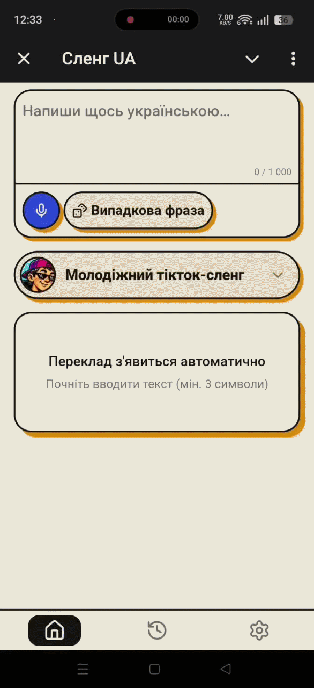

<div align="center">

<!-- 🖼 ⟨docs/assets/logo.svg 112×112 — розкоментувати, коли файл з'явиться⟩

-->

# SlangUA

**Один текст. Шість українських стилів.**

AI-перекладач звичайної української у сучасні стилі мовлення —
зміст залишається, форма змінюється до невпізнання.

[](https://github.com/AlexToster/SlangUA/actions/workflows/ci.yml)
[](LICENSE)
[](package.json)
[](tsconfig.json)
[](https://t.me/SlangUA_bot)
[](plans/ROADMAP.md)

### [🚀 Спробувати в Telegram](https://t.me/SlangUA_bot) · [🎬 Демо](#демо) · [🎨 Стилі](#стилі) · [📚 Документація](plans/docs/README.md)

<sub><b>English:</b> SlangUA rewrites plain Ukrainian text into six contrasting
modern registers — Gen Z, street, IT, bureaucratic, prison and Galician —
keeping the meaning intact while changing the form as much as possible.
It is a style translator, not a dictionary, chatbot or machine translator.
Telegram Mini App on top of Fastify, Prisma and a multi-provider LLM layer
(OpenAI, Anthropic, Gemini, OpenRouter, local Ollama). MVP in development.</sub>

</div>

## Демо

Один і той самий текст, шість контрастних стилів:

> **Оригінал:** «Я йду додому, там мене чекають друзі.»

| Стиль | Результат |
| ----- | --------- |
| 🔥 **GEN_Z** — TikTok / Discord | 🖼 ⟨вставити реальний вивід⟩ |
| 🚬 **STREET** — двір і вулиця | «Йду в хату, там братва... ой, пацани вже чекають.» |
| 💻 **IT_SLANG** — технічний спіч | 🖼 ⟨вставити реальний вивід⟩ |
| 🏛 **KANCLER** — бюрократ | 🖼 ⟨вставити реальний вивід; тут має бути видно подовження у 2–4 рази⟩ |
| ⛓ **POFENI** — жаргон, 18+ | «Двигаю до себе — там кореші вже чекають.» |
| 🍺 **GALICIAN** — львівська ґвара | 🖼 ⟨вставити реальний вивід⟩ |

<details>
<summary><b>Ще приклади — справжні пари з <code>examples.json</code></b></summary>

Це не ілюстрації для README, а ті самі приклади, які Style Engine підкладає
моделі у промпт: `src/style-engine/styles/*/examples.json`.

| Стиль | Було | Стало |
| ----- | ---- | ----- |
| `GEN_Z` | Це дуже соромно, я не можу в це повірити. | Крінж чиста вода, не можу це зачіпнути. |
| `STREET` | Це коштує багато грошей, я не можу це дозволити. | Це бабло велике, на таку роздачу у мене немає. |
| `IT_SLANG` | Мені потрібно розгорнути нову версію на продакшн. | Треба задеплоїти хотфікс на продакшн, ролбек не варіант. |
| `KANCLER` | Дай мені відповідь. | Прошу надати вичерпну відповідь у визначений термін, беручи до уваги вищевикладені обставини та відповідно до чинного порядку розгляду звернень. |
| `POFENI` | Не бреши, говори правду, інакше буду проблеми. | Не гони. Базар по поняттях, інакше буде зашквар. |
| `GALICIAN` | Давай швидко сходимо в магазин по хліб, поки не пізно. | Ходи борше до склепу за булкою, най ся не спізнимо. |

</details>

<div align="center">

🖼 ⟨demo.gif, 10–15 с: вставив текст → GEN_Z → перемкнув на KANCLER → «Поділитися»⟩

<!--  -->

</div>

| Переклад | Вибір стилю | Історія |
| :------: | :---------: | :-----: |
| 🖼 ⟨screenshot-translate.png⟩ | 🖼 ⟨screenshot-styles.png⟩ | 🖼 ⟨screenshot-history.png⟩ |

<!-- Після появи файлів замінити рядок вище на:
|  |  |  |
-->

> **Чесно про стан:** MVP у розробці. Backend готовий, фронтенд і
> Telegram-шеринг допилюються ([Stage 7](plans/ROADMAP.md)). Стиль `POFENI` —
> 18+. Якість виводу залежить від обраної LLM: локальна
> 7B-модель дасть слабший результат, ніж модель класу GPT-4.

## Що це таке

SlangUA — **AI style translator**, а не словник, чат-бот, генератор текстів чи
машинний перекладач. Він бере твій текст і переписує його в інший стиль:

> зміст зберігається повністю, форма змінюється максимально.

Кожен стиль має власний словник, промпт, приклади та «особистість», і стилі
навмисно контрастні між собою — результат мусить бути впізнаваним з першого
рядка, без підпису, який це стиль.

Трансформація не однакова за силою: **KANCLER** свідомо роздуває речення у 2–4
рази, **GEN_Z** тримає приблизно ту саму довжину, **POFENI** говорить крізь
тюремну ієрархію і «поняття» — це інший регістр, ніж **STREET** (двір і вулиця).

Технічно: [як побудований Style Engine](plans/docs/07-styles.md) ·
[архітектурні рішення](plans/docs/05-decisions.md)

## Стилі

Шість стилів. Ідентифікатори — значення enum `SlangStyle`.

| Стиль | Голос | Як звучить |
| ----- | ----- | ---------- |
| `GEN_Z` | TikTok, Instagram, Discord | «Сквад фармить лобі всю ніч, грінд не для слабких.» |
| `STREET` | дворовий, вулиця, базар | «Це бабло велике, на таку роздачу у мене немає.» |
| `IT_SLANG` | технічний спіч, продакшн і деплої | «Продакшн даун, алерт спрацював — лезу дебажити.» |
| `KANCLER` | бюрократ, радянщина; текст довшає у 2–4 рази | «Прошу надати вичерпну відповідь у визначений термін, беручи до уваги вищевикладені обставини…» |
| `POFENI` **18+** | тюремний жаргон, «поняття» | «Не гони. Базар по поняттях, інакше буде зашквар.» |
| `GALICIAN` | львівська ґвара | «Ходи борше до склепу за булкою, най ся не спізнимо.» |

`POFENI` доступний лише після підтвердження повноліття.
Приклади вище — справжні пари з `src/style-engine/styles/*/examples.json`.
Додати свій стиль — [чекліст в AGENTS.md](AGENTS.md).

## Можливості

- **Шість контрастних стилів** — від TikTok до бюрократа, з age gate для 18+.
- **Telegram Mini App** — працює всередині Telegram, без реєстрації та паролів:
  вхід через `initData`.
- **Історія та улюблені** — останні 100 перекладів; позначені зірочкою
  зберігаються без обмежень.
- **Шеринг лише в Telegram** — переклад іде у вибраний чат як текст, без
  публічних посилань на твій текст.
  [Чому саме так](plans/docs/09-telegram-sharing.md).
- **Будь-яка LLM** — OpenAI, Anthropic, Gemini, OpenRouter, локальний Ollama або
  будь-який OpenAI-сумісний ендпоінт; додається змінними середовища, без зміни
  коду. Автоматичний fallback між провайдерами і ротація ключів за лімітами.
- **Панель оператора** — вхід за Telegram-allowlist плюс пароль, кіл-світч
  провайдера, навантаження по хвилинах і добах, стрічка останніх `5xx`.
  Вимкнена за замовчуванням: без `ADMIN_TELEGRAM_IDS` маршрутів просто не існує.

## Спробувати

**Найшвидший шлях —** [@SlangUA_bot](https://t.me/SlangUA_bot) у Telegram.
Реєстрація не потрібна: вхід через Telegram-акаунт.

Хочеш свій інстанс — далі про локальний запуск.

## Швидкий старт

> ~5 хвилин, якщо PostgreSQL і Redis уже запущені. Потрібен хоча б один AI-ключ
> або локальний Ollama: без жодного провайдера сервер підніметься, але переклад
> повертатиме помилку.

### Передумови

- **Node.js ≥ 20** та npm.
- **PostgreSQL** і **Redis** — локально або у Docker.
- **Docker Desktop** — лише для інтеграційних тестів (Testcontainers).
- **Telegram Bot Token** — для реальної автентифікації Mini App.
- Щонайменше один AI-провайдер: ключ до OpenAI / Anthropic / Gemini /
  OpenRouter **або** локальний Ollama.

### Backend

```bash
# 1. Встановити залежності
npm install

# 2. Створити .env на основі шаблону та заповнити змінні
cp .env.example .env

# 3. Згенерувати Prisma Client
npm run prisma:generate

# 4. Застосувати міграції до бази
npm run prisma:migrate

# 5. Запустити dev-сервер (http://localhost:3000)
npm run dev
```

Production-збірка: `npm run build`, запуск — `npm start`.

### Frontend

```bash
cd frontend
npm install
npm run dev   # http://localhost:5173, запити на /api ідуть на localhost:3000
```

### Конфігурація

Джерело правди — Zod-схема у [`src/config/index.ts`](src/config/index.ts):
невалідна конфігурація зупиняє запуск процесу, а значення-заглушки з
`.env.example` відхиляються при `NODE_ENV=production` — копію прикладу
неможливо задеплоїти як є.

**Мінімум для старту:** `DATABASE_URL`, `REDIS_URL`, `JWT_SECRET`,
`REFRESH_TOKEN_HMAC_SECRET`, `TELEGRAM_BOT_TOKEN`, `PREVIEW_ROOT_KEY`
і хоча б один AI-ключ.

Адмін-панель вимкнена за замовчуванням: поки `ADMIN_TELEGRAM_IDS` порожній,
усі маршрути `/api/v1/admin/*` віддають 404.

Голосовий ввід теж вимкнений за замовчуванням: поки `STT_API_KEY` порожній,
клієнт не показує мікрофон, а `POST /api/v1/transcribe` віддає
`503 STT_UNAVAILABLE`. Провайдер транскрипції — будь-який OpenAI-сумісний
(`STT_BASE_URL` + `STT_MODEL`), за замовчуванням Groq `whisper-large-v3-turbo`.
Записане аудіо не зберігається ніде.

Значення з `$` — зокрема `ADMIN_PASSWORD_HASH`, який містить його завжди —
беріть в одинарні лапки: у production `.env` читає парсер Docker Compose, і без
лапок він вирізає з рядка `$N`, а застосунок відмовляється стартувати на
насправді коректному хеші.

Повний довідник змінних середовища — [docs/configuration.md](docs/configuration.md);
синхронізований зі схемою перелік з коментарями — [`.env.example`](.env.example).

### Тести

```bash
npm test          # усе: typecheck + smoke + unit + integration
npm run test:unit # без Docker
```

Інтеграційні тести піднімають тимчасові PostgreSQL і Redis через Testcontainers
(потрібен Docker) і не роблять жодного зовнішнього запиту — LLM підміняється
локальним OpenAI-сумісним моком. Те саме виконує
[CI](.github/workflows/ci.yml) на кожен push і PR у `main`.
Деталі, структура тестів і що саме покриває кожен набір —
[CONTRIBUTING.md](CONTRIBUTING.md#тестування).

<details>
<summary>Не запускається?</summary>

- `Config validation failed` — не заповнений обов'язковий ключ у `.env`;
  повний перелік з описами: [docs/configuration.md](docs/configuration.md).
- Порт `3000` зайнятий — змінити `PORT`.
- Переклад повертає помилку, хоча сервер піднявся — не задано жодного AI-ключа
  або вибраний провайдер відключений кіл-світчем (`ai:provider:disabled` у Redis).
- 🖼 ⟨додати 1–2 реальні граблі, на які ти сам наступив під час деплою⟩

</details>

## Технології

| Шар | Стек |
| --- | ---- |
| Backend | Node.js ≥ 20 · TypeScript · Fastify · Prisma · PostgreSQL · Redis · Zod |
| Frontend | React · Vite · Telegram Mini App SDK · звичайний CSS, по файлу на компонент (Tailwind свідомо не використовується) |
| AI | OpenAI · Anthropic · Gemini · OpenRouter · Ollama, через adapter pattern |

**Про AI-шар.** Класів адаптерів три, а не п'ять: `OpenAICompatibleAdapter`
обслуговує всіх, хто розмовляє форматом OpenAI Chat Completions (OpenAI,
OpenRouter, локальна Ollama через `/v1`), власні класи мають лише Anthropic і
Gemini. Провайдер — це набір змінних середовища, а не enum і не код, тому Groq,
DeepSeek, vLLM чи проксі підключаються через `AI_EXTRA_INSTANCES` без міграції
бази і без змін у клієнті. Кожен ключ можна задати списком через кому —
вичерпаний відкладається, запит обслуговує наступний. Ланцюжок fallback можна
розірвати вручну: кіл-світч оператора вимикає провайдера до явного повернення,
не «лікуючись» ні кулдауном, ні рестартом.

Як додати провайдера — [AGENTS.md](AGENTS.md).

## Архітектура

```text
Telegram Mini App → Fastify → Translation Service → AI Service → AI Provider → LLM
                                                         ↑
                                              Style Engine (бібліотека)
                                    registry · prompt · examples · lexicon
```

**Style Engine** будує системний промпт — і більше нічого: без бізнес-логіки,
без бази даних, без викликів LLM. Його споживає `base.adapter.ts`, тому це не
ланка в ланцюжку виклику, а бібліотека збоку. Публічний контракт зафіксований,
щоб згодом перевести стилі з файлів у базу або API, не переписуючи споживачів.

Детально: [архітектура](plans/architecture.md) ·
[backend](plans/docs/01-backend.md) · [frontend](plans/docs/02-frontend.md) ·
[база даних](plans/docs/03-database.md) · [API](plans/docs/04-api.md) ·
[безпека](plans/docs/06-security.md)

## Статус

Активна розробка MVP. Стан по етапах — у [ROADMAP](plans/ROADMAP.md),
тут — коротко:

| Що | Стан |
| --- | --- |
| Backend, API, база, Style Engine (6 стилів) | ✅ готово для MVP |
| Шар доступу до адмінки: allowlist + пароль, кіл-світч, метрики, стрічка помилок | ✅ готово |
| Frontend + Telegram Mini App | 🚧 Stage 7, у роботі |
| Інтеграція і тестування | ⏭ Stage 8, наступний |
| Публічний деплой | 🗓 Stage 9, запланований |

**Далі:** нові стилі та ширші словники · керування стилями з адмінки без зміни
коду (промпти, словники, приклади, версії) · fallback між моделями · PWA, web і
мобільні клієнти.

Принцип розвитку: спочатку просте рішення, потім стабілізація, і лише після
цього — нові абстракції.

## Документація

Повний індекс — [plans/docs/README.md](plans/docs/README.md). Найкорисніше:

- [Архітектура](plans/architecture.md) — діаграми і побудова
- [Style Engine](plans/docs/07-styles.md) — стилі, словники, приклади
- [API](plans/docs/04-api.md) — маршрути, DTO, контракти
- [Безпека](plans/docs/06-security.md) — автентифікація, rate limiting, дані
- [Конфігурація](docs/configuration.md) — усі змінні середовища
- [ROADMAP](plans/ROADMAP.md) — етапи і статуси
- [AGENTS.md](AGENTS.md) — робочі правила та інваріанти проєкту
- [SLANGUA-BRIEFING.md](plans/SLANGUA-BRIEFING.md) — самодостатній технічний
  дамп, який можна віддати будь-якій моделі

> **Мова документації:** README, [AGENTS.md](AGENTS.md) і
> [CONTRIBUTING.md](CONTRIBUTING.md) — українською; технічна документація в
> `plans/**` — англійською. Дотримуйтеся цього для нових документів.

---

## Внесок

PR і issue вітаються. Перед початком — [CONTRIBUTING.md](CONTRIBUTING.md) та
[AGENTS.md](AGENTS.md) (інваріанти, які легко порушити випадково).

Особливо цінний внесок — **словники і приклади для стилів**: за них не потрібно
знати архітектуру, достатньо чуття мови.
🖼 ⟨якщо готовий приймати такі PR — постав теґ `good first issue` на кілька
конкретних задач і посилайся тут на них⟩

## Зворотний зв'язок

Обговорення і повідомлення про баги —
[канал у Telegram](https://t.me/+1lYdnphwsLBlZWMy) або
[GitHub Issues](https://github.com/AlexToster/SlangUA/issues).

## Ліцензія

[MIT](LICENSE) © AlexToster

<div align="center">
Якщо ідея зайшла — ⭐ репозиторію допомагає її знайти іншим.
</div>

