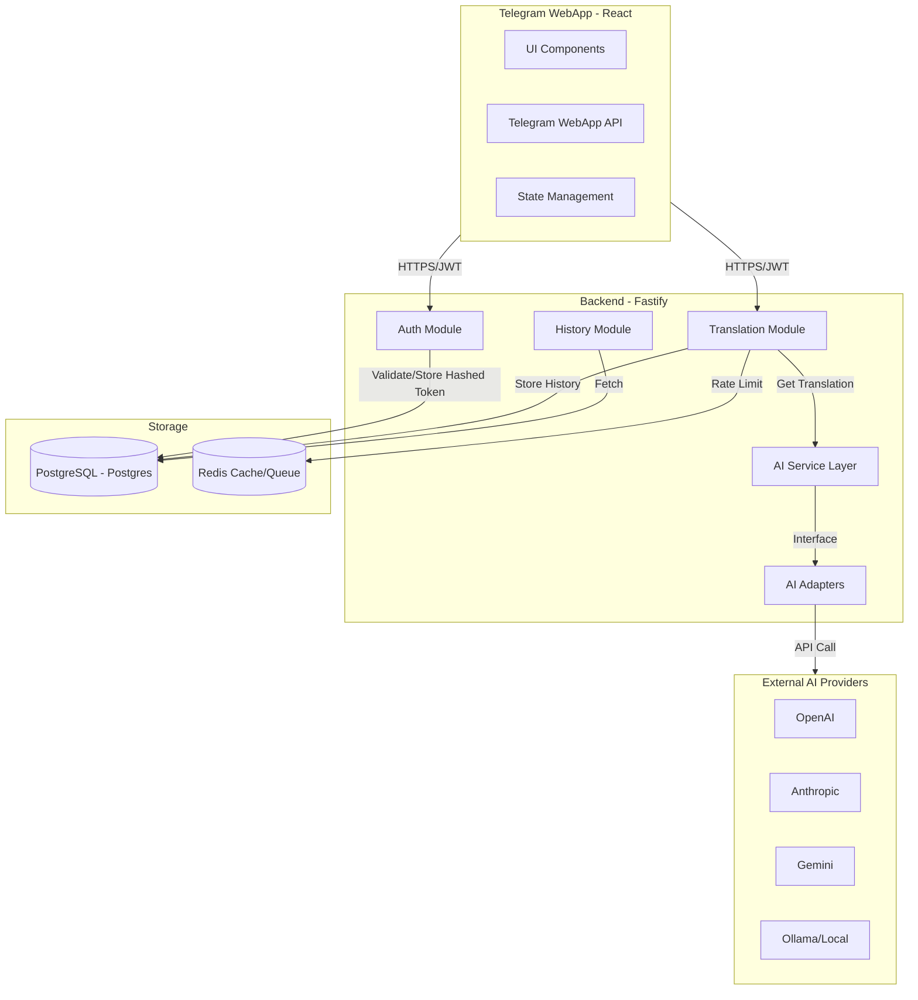
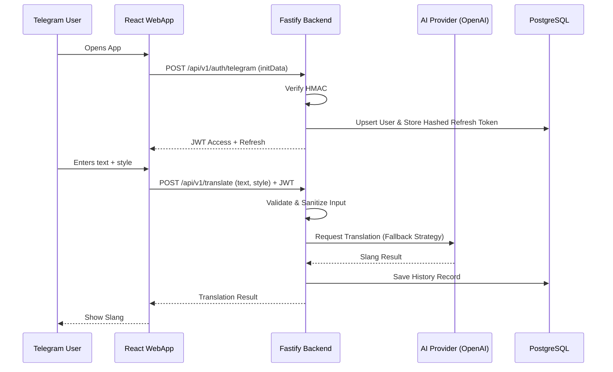

# Architecture Design: SlangUA

This document outlines the architectural design for SlangUA, a Telegram WebApp that translates standard Ukrainian into modern slang using AI.

## 1. High-Level Architecture

SlangUA uses a modern full-stack architecture optimized for low-latency interactions within the Telegram ecosystem. All REST APIs are versioned (e.g., `/api/v1/...`).

- **Client Layer**: React-based Single Page Application (SPA) running inside Telegram WebApp.
- **API Gateway / Proxy**: Nginx for SSL termination, static file serving, and reverse proxying to the backend.
- **Application Layer**: Node.js/Fastify backend providing versioned RESTful APIs.
- **Storage Layer**:
    - **PostgreSQL**: Persistent relational data (Users, Translation History, Hashed Refresh Tokens with expiration and optional device/session info).
    - **Redis**: Ephemeral data only (Caching, rate limiting, and other transient state).
- **AI Integration Layer**: Provider-agnostic service using the Adapter Pattern with a built-in fallback strategy, timeout handling, retry policies, and automatic failover.

## 2. Mermaid Architecture Diagram



## 3. Main Modules

### Backend (Node.js/Fastify)

### Backend Layering

```text
Telegram Mini App
        ↓
Fastify Route (Plugin + TypeBox/Zod validation)
        ↓
Service (Business Logic)
        ├── Prisma Client
        ├── Redis
        └── AI Adapter
                ├── OpenAI
                ├── Gemini
                ├── Claude
                └── Future providers
        ↓
PostgreSQL
```

> **Note:** For simplicity, the **"AI Adapter"** block in this layering diagram represents the complete AI integration subsystem described later in the **AI Service & Adapters** section, including the AI Service, Provider Factory, provider adapters, and concrete AI providers.

- **Fastify Routes**
  - endpoint registration
  - request validation
  - response formatting
  - no business logic

- **Services**
  - business logic
  - direct Prisma Client access
  - direct Redis access where appropriate
  - AI Adapter usage
  - transaction coordination

- **Prisma Client**
  - the only database access layer

- **AI Adapter**
  - abstraction over AI providers
  - provider selection
  - retry
  - timeout
  - fallback

This project intentionally uses a simplified Route → Service → Prisma architecture suitable for a solo-developer MVP. This is a proactive architectural decision.

- **`Auth Module`**:
    - Validates `WebAppData` using HMAC-SHA256 (Telegram Secret).
    - After successful HMAC verification, `auth_date` must be validated against a configurable TTL (configured via an environment variable) to mitigate replay attacks.
    - Requests with an expired `auth_date` must be rejected.
    - Manages JWT Access and Hashed Refresh tokens (stored in PostgreSQL with expiration).
    - Extensible `AuthStrategy` for future providers.
- **`Translation Module`**:
    - Validates input text (length, content) and performs basic prompt injection protection.
    - Manages "Slang Styles" (e.g., "Gen-Z", "Street", "IT-Slang").
    - Orchestrates AI calls and database logging.
- **`AI Service & Adapters`**:
    - **`IAIProvider`**: Interface defining `translate(text, style)` method.
    - **`AIService`**: Implements provider fallback strategy, timeout handling, and retry policy.
    - **`OpenAIAdapter`**, **`ClaudeAdapter`**, **`GeminiAdapter`**, **`OllamaAdapter`**: Implementation details for each provider.
    - **`ProviderFactory`**: Resolves implementation based on priority and availability.
- **`History Module`**:
    - Provides paginated access to user-specific translations.
    - Handles "Favorite" flagging and search.
- **`User Module`**:
    - Basic profile management (settings, preferences).

### Frontend (React/Vite)
- **`Telegram Integration`**: Hooks for managing Telegram theme, Haptic Feedback, and MainButton.
- **`API Layer`**: Typed Axios/React-Query client for backend communication.
- **`Translation Workspace`**: Dynamic UI for input, slang style selection, and real-time results.
- **`History View`**: Infinite-scroll list of previous translations.

## 4. Communication Flow

1. **Handshake**: Frontend retrieves `initData` from Telegram, sends to `/api/v1/auth/telegram`.
2. **Session**: Backend verifies data, checks/creates user in PostgreSQL, stores hashed Refresh Token, returns JWTs.
3. **Translation Request**:
    - User selects "Gen-Z" style and types "Привіт".
    - Frontend sends POST `/api/v1/translate` with payload and JWT.
4. **AI Processing**:
    - Backend validates input and sanities against prompt injection.
    - `AIService` selects the primary provider (e.g., `OpenAIAdapter`).
    - Generates system prompt based on selected style.
    - Calls OpenAI API.
5. **Persistence & Response**:
    - Backend saves both original and slang version to PostgreSQL.
    - Returns JSON response to Frontend.
6. **Caching**: Redis tracks request frequency per user ID to prevent abuse.

## 5. Architectural Rationale

- **Fastify**: Chosen for its industry-leading performance and built-in schema validation. During development, it runs directly on the host for better debugging and performance.
- **Prisma**: Provides a type-safe ORM that perfectly complements TypeScript, reducing runtime database errors.
- **Redis**: Used exclusively for caching, rate limiting, and ephemeral data to ensure low-latency performance.
- **Adapter Pattern & AIService**: Provides high availability. The fallback strategy ensures that if the primary AI provider fails, the system automatically switches to a backup, maintaining service continuity.
- **Hybrid Docker Workflow**:
    - **Development**: PostgreSQL and Redis run in Docker; Fastify backend runs on the host.
    - **Production**: Full Docker Compose stack for consistent deployment and integration testing.



## 6. AI Provider Configuration

The `AIService` is managed via a central configuration that defines the operational parameters for all adapters:

- **Provider Priority**: An ordered list determining which provider to attempt first.
- **Enable/Disable Flags**: Granular control to toggle specific providers (e.g., disabling a provider during maintenance).
- **API Keys**: Injected via environment variables (e.g., `OPENAI_API_KEY`).
- **Timeouts**: Specific duration limits for each provider to prevent hanging requests.
- **Retry Policy**: Defined number of attempts and backoff intervals for transient error handling.
- **Fallback Behavior**: Automatic escalation to the next highest-priority enabled provider upon failure or timeout.

## 7. Development Roadmap

Implementation of this architecture is tracked in the [ROADMAP.md](ROADMAP.md) file.

- **architecture.md**: Documents the system design and technical specifications.
- **ROADMAP.md**: Defines the recommended sequence of implementation stages and deliverables.
- Both documents must remain synchronized as the project evolves to ensure the implementation reflects the intended design.

## 8. Database Design

### Conceptual Database Model

The following entities represent the persistent state of the SlangUA system, managed within PostgreSQL using Prisma.

#### 1. User
- **Purpose**: Represents a unique person interacting with the SlangUA bot.
- **Responsibility**: Stores the user's Telegram identity and application-level preferences.
- **Why it exists**: To associate translations with a specific identity, enable translation history, and manage persistent user settings.

#### 2. Translation
- **Purpose**: Represents a single translation event from standard Ukrainian to slang.
- **Responsibility**: Stores the source text, the resulting slang, the style used, the AI provider that performed the translation, and the "favorite" status.
- **Why it exists**: To provide users with a history of their translations and allow them to "bookmark" (favorite) specific results for quick access.

#### 3. RefreshToken
- **Purpose**: Manages long-lived authentication sessions.
- **Responsibility**: Stores hashed refresh tokens associated with a specific user, along with their expiration and metadata (e.g., device info).
- **Why it exists**: To provide a secure way to renew JWT access tokens without requiring the user to re-authenticate via Telegram `initData` constantly.

### Relationships and Cardinality

- **User — Translation**: One-to-Many (1:N). One user can have many translations in their history, but every translation record belongs to exactly one user.
- **User — RefreshToken**: One-to-Many (1:N). One user can have multiple active sessions (e.g., on different devices), each represented by a separate refresh token record.

### Business Rules for the Data Model

- **Favorites**: The "favorite" status is an attribute of the `Translation` entity (`Translation.favorite: BOOLEAN`). There is no separate "Favorite" entity to keep the model simple and performant for the MVP scope.
- **Persistence**: All three entities (User, Translation, RefreshToken) are stored in PostgreSQL for permanent availability.
- **Relational Integrity**: Deleting a `User` should trigger a cascade delete of their `Translations` and `RefreshTokens` (to be defined in the Prisma schema stage).
- **Redis Exclusion**: Redis is used exclusively for transient data (rate limits, short-term caching) and is not part of this relational/conceptual model.

### Entity Definitions

#### Entity: User
- **telegramId**:
  - Purpose: Unique identifier from Telegram.
  - Conceptual Type: String (or Large Integer, but conceptually unique identity).
  - Required: Yes.
  - Business Rule: Must be unique.
- **username**:
  - Purpose: Telegram handle for display or identification.
  - Conceptual Type: String.
  - Required: No.
- **firstName**:
  - Purpose: User's first name from Telegram.
  - Conceptual Type: String.
  - Required: No.
- **lastName**:
  - Purpose: User's last name from Telegram.
  - Conceptual Type: String.
  - Required: No.
- **languageCode**:
  - Purpose: Preferred language from Telegram settings.
  - Conceptual Type: String.
  - Required: No.
- **createdAt**:
  - Purpose: Timestamp of registration.
  - Conceptual Type: DateTime.
  - Required: Yes.
  - Default: Current timestamp.

#### Entity: Translation
- **userId**:
  - Purpose: Link to the User who performed the translation.
  - Conceptual Type: Integer/ID.
  - Required: Yes.
- **originalText**:
  - Purpose: The source Ukrainian text provided by the user.
  - Conceptual Type: String.
  - Required: Yes.
- **translatedText**:
  - Purpose: The resulting slang text generated by AI.
  - Conceptual Type: String.
  - Required: Yes.
- **slangStyle**:
  - Purpose: The specific slang style requested (e.g., "Gen-Z", "Street").
  - Conceptual Type: Enum (SlangStyle).
  - Required: Yes.
- **aiProvider**:
  - Purpose: The AI provider used for this specific translation.
  - Conceptual Type: Enum (AIProvider).
  - Required: Yes.
- **favorite**:
  - Purpose: Flag indicating if the user "bookmarked" this translation.
  - Conceptual Type: Boolean.
  - Required: Yes.
  - Default: False.
- **createdAt**:
  - Purpose: Timestamp of the translation event.
  - Conceptual Type: DateTime.
  - Required: Yes.
  - Default: Current timestamp.

#### Entity: RefreshToken
- **userId**:
  - Purpose: Link to the User who owns this session.
  - Conceptual Type: Integer/ID.
  - Required: Yes.
- **hashedToken**:
  - Purpose: Securely stored refresh token.
  - Conceptual Type: String.
  - Required: Yes.
- **expiresAt**:
  - Purpose: Timestamp when the token becomes invalid.
  - Conceptual Type: DateTime.
  - Required: Yes.
- **deviceInfo**:
  - Purpose: Metadata about the device/session (e.g., browser, platform).
  - Conceptual Type: JSON.
  - Required: No.
- **createdAt**:
  - Purpose: Timestamp of token issuance.
  - Conceptual Type: DateTime.
  - Required: Yes.
  - Default: Current timestamp.

### Conceptual Enums

#### Enum: SlangStyle
- **GEN_Z**: Modern youth slang.
- **STREET**: Urban/street style.
- **IT_SLANG**: Professional/tech-oriented slang.

#### Enum: AIProvider
- **OPENAI**: OpenAI models.
- **ANTHROPIC**: Claude models.
- **GEMINI**: Google Gemini models.
- **OLLAMA**: Local/self-hosted models.

### Relationships, Constraints & Indexes

#### Primary Keys
- Every entity (**User**, **Translation**, **RefreshToken**) has a unique Primary Key (conceptually an auto-incrementing Integer or UUID) to uniquely identify records.

#### Foreign Keys
- **Translation.userId**: Points to **User.id**. Ensures every translation is linked to a valid user.
- **RefreshToken.userId**: Points to **User.id**. Ensures every session is linked to a valid user.

#### Unique Constraints
- **User.telegramId**: Prevents duplicate accounts for the same Telegram user.
- **RefreshToken.hashedToken**: Ensures token uniqueness across the system.

#### Required Indexes
- **User.telegramId**: (Unique Index) For extremely fast user lookup during auth handshake.
- **Translation.userId**: To optimize fetching history for a specific user.
- **Translation.createdAt**: To optimize sorting history by date (newest first).
- **RefreshToken.userId**: To optimize finding all active sessions for a user.
- **RefreshToken.hashedToken**: (Unique Index) For fast token validation during refresh flow.

#### Cascade Behavior
- **ON DELETE User**:
  - **Translations**: CASCADE. If a user is deleted, their translation history is removed.
  - **RefreshTokens**: CASCADE. If a user is deleted, all their active sessions are invalidated.
- **ON UPDATE**:
  - All foreign keys should use CASCADE to maintain referential integrity if a Primary Key changes (though PKs are usually immutable).

#### Business Rule Enforcement
- The deletion of a **User** must automatically clean up all associated data (**Translation History** and **Refresh Tokens**) to comply with data privacy and system cleanliness.

### Data Lifecycle

#### Entity: User
- **Creation**: Occurs during the first `/auth/telegram` handshake if the `telegramId` does not exist.
- **Read**: Frequent; performed during every authentication or session validation to retrieve user profile/preferences.
- **Update**: Occurs when a user changes application settings (e.g., default style).
- **Delete**: Performed upon explicit request for account deletion or system cleanup.
- **Retention**: Permanent until manual deletion.

#### Entity: Translation
- **Creation**: Occurs after every successful AI translation call.
- **Read**: Performed when a user views their history or "favorites" list.
- **Update**: Limited to toggling the `favorite` flag.
- **Delete**: Occurs if the user deletes a specific record or upon User deletion (CASCADE).
- **Retention**: Permanent (history) to provide value over time.

#### Entity: RefreshToken
- **Creation**: Occurs during initial authentication or successful token refresh.
- **Read**: Performed during the `/auth/refresh` flow to validate the session.
- **Update**: Tokens are typically rotated (deleted/re-created) rather than updated.
- **Delete**: Occurs during logout, session invalidation, or expiration.
- **Retention**: Temporary; automatically invalidated after `expiresAt`.

### Redis Responsibilities

Redis serves as a low-latency ephemeral store for data that does not require long-term persistence in PostgreSQL.

#### 1. Cache
- **Purpose**: Store frequently accessed but non-critical data.
- **Data Examples**: AI provider availability status, transient configuration flags.
- **Lifetime**: 5–15 minutes (volatile).
- **Storage**: Redis Only.

#### 2. Rate Limiting
- **Purpose**: Prevent abuse of the translation API and AI providers.
- **Data Examples**: Request counters per `userId` or `IP`.
- **Lifetime**: Sliding window (e.g., 1 minute or 24 hours depending on limit type).
- **Storage**: Redis Only.

#### 3. Temporary State
- **Purpose**: Manage transient application state.
- **Data Examples**: `initData` nonces (if implemented for additional security) or short-term pending task statuses.
- **Lifetime**: 1–2 hours (short-lived).
- **Storage**: Redis Only.

#### Summary of Storage Strategy
- **PostgreSQL**: Source of truth for all relational, permanent data (**Users**, **Translations**, **Hashed Refresh Tokens**). If Redis is cleared, the core system functionality remains intact.
- **Redis**: Performance accelerator and protector. Used for data that is either easily re-creatable or purely transient in nature (**Rate limits**, **Cache**).

### Scalability & Future-Proofing

The conceptual database model is designed to support future evolution while maintaining backward compatibility and performance.

#### 1. Multiple AI Providers & Slang Styles
- **Current Support**: The use of **Enums** (`AIProvider`, `SlangStyle`) allows for the easy addition of new values without changing the table structure.
- **Scalability**: The `Translation` entity already tracks which provider and style were used for every record, enabling style-specific or provider-specific analysis.

#### 2. Premium Subscriptions
- **Extension (Optional)**: A `subscriptionTier` field could be added to the `User` entity, or a separate `Subscription` entity could be linked to the `User`.
- **Compatibility**: Existing users would default to a "Free" tier.

#### 3. Admin Panel & Statistics
- **Current Support**: The schema provides all necessary data for basic analytics (user growth, translation volume, popular styles, AI provider performance).
- **Scalability**: Indexes on `createdAt` and `userId` ensure that statistical queries remain performant as the dataset grows.

#### 4. Ukrainian Speech-to-Text (STT)
- **Extension (Optional)**: A `voiceUrl` or `voiceBlobId` field could be added to the `Translation` entity to store references to the original audio.
- **Compatibility**: Existing text-only translations would simply have this field as null.

#### 5. Backward Compatibility Principles
- **Add, Don't Change**: Prefer adding new optional fields over modifying existing required ones.
- **Default Values**: Use sensible defaults for new fields to ensure existing application logic remains functional.
- **Data Integrity**: Always maintain foreign key constraints and cascade rules during extensions to prevent orphaned records.

### Final Database Review

A comprehensive review of the conceptual database model has been performed to ensure alignment with project requirements.

#### Verification Checklist
- **Entity Completeness**: All required persistent entities (**User**, **Translation**, **RefreshToken**) identified in the architecture are present.
- **Consistency**: Relationships and cardinality (1:N) are consistent across the model.
- **Normalization**: The model is appropriately normalized for the MVP scope (3NF equivalent for core entities).
- **Data Efficiency**: No unnecessary data duplication exists. Business rules (e.g., `Translation.favorite`) are implemented efficiently.
- **Indexing**: Sufficient indexes are defined for authentication, history retrieval, and session management.
- **Referential Integrity**: Cascade rules for `ON DELETE User` ensure consistent data cleanup.
- **Architecture Alignment**: 
    - Supports the **Communication Flow** (handshake, session, translation).
    - Supports the **Backend Modules** (Auth, Trans, History, User).
    - Supports the **AI Provider Strategy** (tracking provider usage and fallbacks).

The conceptual database model is approved and ready for Stage 3 — Prisma Schema Design.

All entity names and field names defined in this conceptual model should be reused consistently during Stage 3 (Prisma Schema Design) unless a documented architectural decision requires otherwise.

## 9. Prisma Schema Design

The concrete database schema is defined and maintained in the [schema.prisma](../prisma/schema.prisma) file.

- **Implementation File**: The working Prisma schema is created and maintained in [prisma/schema.prisma](../prisma/schema.prisma).
- **Tooling Integration**: The schema is used directly by the Prisma CLI for client generation and database migrations.
- **Relationship to Conceptual Design**: The approved [Database Design](#8-database-design) section remains the authoritative conceptual design.
- **Concrete Implementation**: The [prisma/schema.prisma](../prisma/schema.prisma) schema is the concrete implementation of that conceptual model.
