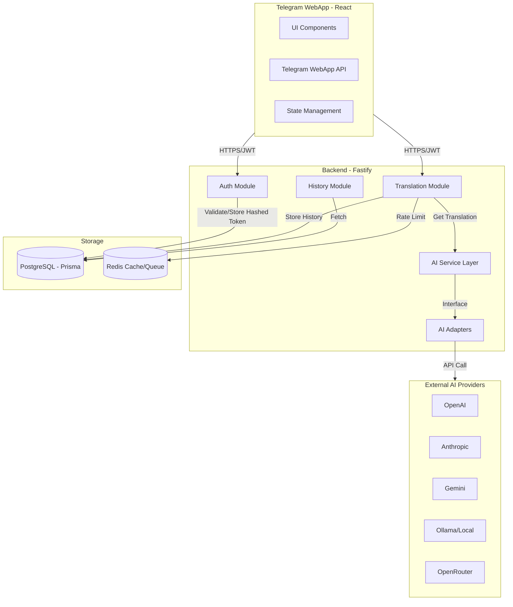

# Architecture Design: SlangUA

This document outlines the architectural design for SlangUA, a Telegram WebApp that translates standard Ukrainian into modern slang using AI.

## 1. High-Level Architecture

SlangUA uses a modern full-stack architecture optimized for low-latency interactions within the Telegram ecosystem. All REST APIs are versioned (e.g., `/api/v1/...`).

- **Client Layer**: React-based Single Page Application (SPA) running inside Telegram WebApp.
- **API Gateway / Proxy**: Nginx for SSL termination, static file serving, and reverse proxying to the backend.
- **Application Layer**: Node.js/Fastify backend providing versioned RESTful APIs.
- **Storage Layer**:
    - **PostgreSQL**: Persistent relational data (Users, Translation History, Hashed Refresh Tokens with expiration and optional device/session info).
    - **Redis**: Ephemeral data only (Caching, rate limiting, and other transient state).
- **AI Integration Layer**: Provider-agnostic service using the Adapter Pattern with a built-in fallback strategy, timeout handling, retry policies, and automatic failover.

## 2. Mermaid Architecture Diagram

## 3. Main Modules

### Backend (Node.js/Fastify)

The backend follows a Route → Service → Prisma layered architecture with an AI Adapter abstraction that provides provider-agnostic AI integration, including fallback, retry, and timeout handling.

### Frontend (React/Vite)

The frontend is a React/Vite SPA with Telegram WebApp integration, a translation workspace for slang style selection and real-time results, and a history view for previous translations.

For full module details, see [Backend Architecture](docs/01-backend.md) and [Frontend Architecture](docs/02-frontend.md).

## 4. Communication Flow

The request lifecycle follows: Telegram handshake → auth/session creation → translation request → AI processing with fallback → persistence to PostgreSQL → response to client. Redis provides rate limiting throughout. For the full 6-step flow, see [Backend Architecture — Communication Flow](docs/01-backend.md#communication-flow).

## 5. Architectural Rationale

Key technology choices: Fastify for high-performance APIs with built-in validation, Prisma for type-safe database access, Redis for low-latency caching and rate limiting, and the Adapter Pattern with AIService for provider-agnostic AI integration with automatic fallback. The hybrid Docker workflow runs the backend on-host during development for debugging speed, while production uses full Docker Compose. For the full rationale, see [Architectural Decisions](docs/05-decisions.md).

## 6. AI Provider Configuration

The `AIService` uses a central configuration defining provider priority, enable/disable flags, API keys (via environment variables), timeouts, retry policies, and automatic fallback behavior. For full details, see [Backend Architecture — AI Provider Configuration](docs/01-backend.md#ai-provider-configuration).

## 7. Documentation Structure

Detailed documentation has been moved to the `plans/docs/` directory.

Навігація — hub-and-spoke: цей документ і plans/docs/README.md лінкують одне на одного навмисно.

- [Documentation Index](docs/README.md)
- [Backend Architecture](docs/01-backend.md)
- [Frontend Architecture](docs/02-frontend.md)
- [Database Design](docs/03-database.md)
- [API Design](docs/04-api.md)
- [Architectural Decisions](docs/05-decisions.md)
- [Security](docs/06-security.md)
- [Styles](docs/07-styles.md)
- [Frontend Design Specification](docs/08-frontend-design.md)
- [Telegram-native Sharing Architecture](docs/09-telegram-sharing.md)
- [Repository Hygiene](docs/10-repository-hygiene.md)
- [Project Roadmap](ROADMAP.md)
- [Prisma Schema](../prisma/schema.prisma)
