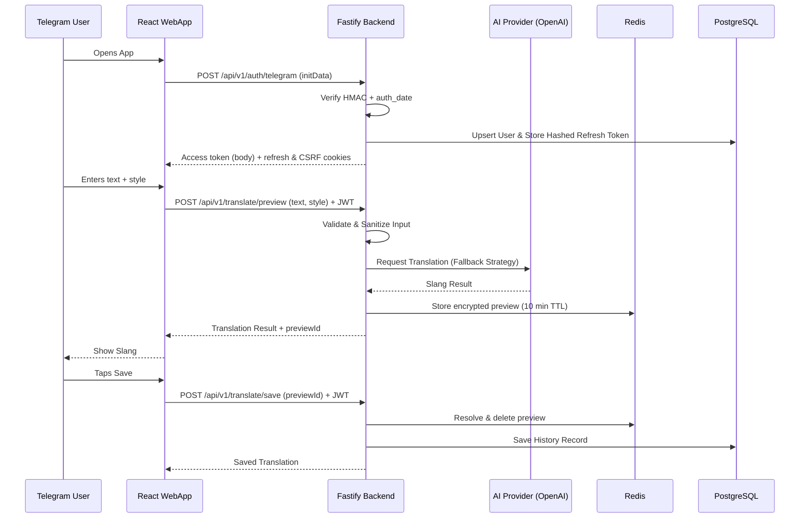

# Backend Architecture

## Main Modules – Backend (Node.js/Fastify)

### Backend Layering

```text
Telegram Mini App
        ↓
Fastify Route (Plugin + TypeBox/Zod validation)
        ↓
Service (Business Logic)
        ├── Prisma Client
        ├── Redis
        └── AI Adapter
                ├── OpenAI-compatible (OpenAI, OpenRouter, local Ollama)
                ├── Anthropic
                └── Gemini
        ↓
PostgreSQL
```

> **Note:** For simplicity, the **"AI Adapter"** block in this layering diagram represents the complete AI integration subsystem described later in the **AI Service & Adapters** section, including the AI Service, Provider Factory, provider adapters, and concrete AI providers.

- **Fastify Routes**
  - endpoint registration
  - request validation
  - response formatting
  - no business logic

- **Services**
  - business logic
  - direct Prisma Client access
  - direct Redis access where appropriate
  - AI Adapter usage
  - transaction coordination

- **Prisma Client**
  - the only database access layer

- **AI Adapter**
  - abstraction over AI providers
  - provider selection
  - retry
  - timeout
  - fallback

See [Architectural Decisions](05-decisions.md) for the rationale behind the simplified Route → Service → Prisma architecture.

- **`Auth Module`**:
    - Validates `WebAppData` using HMAC-SHA256 (Telegram Secret).
    - After successful HMAC verification, `auth_date` must be validated against a configurable TTL (configured via an environment variable) to mitigate replay attacks.
    - Requests with an expired `auth_date` must be rejected.
    - Returns the JWT access token in the response body and keeps it in frontend memory only. The refresh token never appears in JSON: it is set as the HttpOnly `slangua_refresh` cookie, stored HMAC-hashed in PostgreSQL with an expiry, and rotated on every refresh.
    - Pairs that cookie with a readable `slangua_csrf` cookie; `POST /auth/refresh` requires the matching `X-CSRF-Token` header (double-submit), so a cross-site request cannot mint tokens.
    - Access tokens carry a `jti` naming the `RefreshToken` record they came from, which makes per-device logout possible without touching other sessions.
    - Extensible `AuthStrategy` for future providers.
- **`Translation Module`**:
    - Validates input text (length, content) and performs basic prompt injection protection.
    - Manages "Slang Styles" (e.g., "Gen-Z", "Street", "IT-Slang").
    - Serves the Mini App through the preview/save split, which is the only translation contract: `POST /translate/preview` calls the AI and returns an unsaved result held in encrypted Redis, `POST /translate/save` persists it by `previewId` alone.
    - Orchestrates AI calls and database logging.
- **`AI Service & Adapters`**:
    - **`IAIProvider`**: Interface defining `translate(request)` plus the instance's `id` — a lowercase string matching `PROVIDER_ID_PATTERN`, persisted as `Translation.providerId`.
    - **`AIService`**: Implements provider fallback strategy, timeout handling, retry policy and a per-instance circuit breaker (keyed by `id`). Before consulting those breakers it reads the operator kill-switch once per request, so one snapshot governs the whole fallback chain.
    - **`ProviderSwitchService`**: The operator kill-switch, deliberately separate from the circuit breaker — the breaker heals itself, a switch flipped by a human never does. It owns the Redis hash `ai:provider:disabled` (field = provider id → `{ by, at, reason }`, no TTL) and exposes `list()`, `disable()` and `enable()`. A switched-off instance is excluded from the fallback chain, from the recovery probe and from an explicit by-id call; a Redis failure propagates rather than resolving to "nothing is disabled". Flipped through `PATCH /admin/providers/:providerId` and reported by `getProviderOverview()`, which merges factory health with the switch over the union of ids so a stale switch stays visible.
    - **`OpenAICompatibleAdapter`**: One parameterized class for every provider that speaks the OpenAI Chat Completions format. Configured instances today: `openai`, `openrouter` and `ollama` (a local server via its `/v1` endpoint), plus anything listed in `AI_EXTRA_INSTANCES`. Per-instance options: base URL, model, key requirement, temperature, output-cap field name, extra body fields and extra headers.
    - **`ClaudeAdapter`**, **`GeminiAdapter`**: The two providers that keep a native SDK — Anthropic for prompt caching, Gemini because its native API has no system role and needs its own error classification.
    - **`KeyPool`**: Each adapter holds one. `*_API_KEY` accepts a comma-separated list of keys; the pool leases them in turn and parks a key the provider refused for a cooldown (`AI_KEY_COOLDOWN_*`), so a spent free-tier key does not take the whole instance down. With a single key the behaviour is unchanged.
    - **`ProviderFactory`**: Builds one instance per configured id and orders them by `AI_PROVIDER_PRIORITY`. An instance the list does not mention still participates, sorted last; an instance missing its base URL, model or key is skipped with an error log rather than failing boot.
- **`History Module`**:
    - Provides paginated access to user-specific translations.
    - Handles "Favorite" flagging and search.
    - Caps a user's history at `HISTORY_MAX_ENTRIES` (100, a server constant — not configurable per deployment) by pruning the oldest non-favorite rows after every insert. Favorites are never pruned, so a user who stars everything can exceed the cap. `GET /history` echoes the cap as `totalLimit` so the client never hardcodes it.
- **`User Module`**:
    - Basic profile management (settings, preferences).
- **`Admin Module`** (built ahead of [Stage 10](../ROADMAP.md#stage-10--future-features), at the repository owner's request):
    - **`AdminAuthService`**: Two independent factors, neither of them a database row — allowlist membership from `ADMIN_TELEGRAM_IDS` and a scrypt password from `ADMIN_PASSWORD_HASH`, which opens a step-up session in Redis carried by `X-Admin-Token`. Admin-ness is deployment configuration on purpose: a column in Postgres could be edited by anything with write access, and a restore from backup would resurrect a former admin. Everyone else gets a `404` identical to an unregistered route, decided in an `onRequest` hook so that even a malformed body cannot confirm the panel exists.
    - **`MetricsService`**: Counts one finished request into a minute bucket and a UTC-day bucket (requests, plus `5xx` as errors), and adds the internal user id to that day's sorted set. Every write sets an absolute `EXPIREAT` derived from the bucket itself rather than refreshing a TTL, so "the last hour" means the same thing for every key and retention *is* the expiry — nothing prunes. `snapshot()` assembles the zero-filled minute series, the daily rows with `averagePerUser` and today's heaviest users.
    - **`ErrorFeedService`**: The last `ADMIN_ERROR_FEED_MAX` failures as one capped Redis list (`LPUSH` + `LTRIM` + `EXPIRE` in a single `MULTI`), newest first. It is a window, not an archive — the pino logs keep the stack and the full message — which is why there is no `DELETE` and why the stored fields are a whitelist: the route *pattern*, the internal user id, the status code, our error code, a message truncated to 300 characters and the `requestId` that finds the full entry in the logs.
    - Both observability services are written by one `onResponse` hook in `plugins/observability.ts` — after the reply is out, so their writes fail open and cost at most a data point. The hook excludes `OPTIONS`, `/health*` and `/api/v1/admin/*` itself, and takes the error code and message from a two-string snapshot left on the request by whichever code produced the `5xx`.
    - **Prisma models touched: none.** The whole module lives in Redis, which is what made it possible to build out of roadmap order: no migration, no admin column, no user role.

## Communication Flow

1. **Handshake**: Frontend retrieves `initData` from Telegram, sends to `/api/v1/auth/telegram`.
2. **Session**: Backend verifies the HMAC and `auth_date`, checks/creates the user in PostgreSQL, stores the hashed refresh token, and answers with the access token in the body plus the `slangua_refresh` (HttpOnly) and `slangua_csrf` cookies.
3. **Preview Request**:
    - User selects "Gen-Z" style and types "Привіт".
    - Frontend sends POST `/api/v1/translate/preview` with payload and JWT.
4. **AI Processing**:
    - Backend validates input and sanities against prompt injection.
    - `AIService` selects the primary provider (e.g., the `openai` instance of `OpenAICompatibleAdapter`).
    - Generates system prompt based on selected style.
    - Calls OpenAI API.
5. **Preview & Save**:
    - Backend encrypts the result into Redis under a 10-minute TTL and returns it with an opaque `previewId`. Nothing is persisted yet.
    - If the user keeps the result, the frontend sends POST `/api/v1/translate/save` with that `previewId` and no text; the backend writes the History record from the payload it stored itself.
6. **Rate Limiting**: Redis tracks request frequency per user ID to prevent abuse.

There is no one-shot translate-and-persist endpoint. A `POST /api/v1/translate` that collapsed steps 3–5 into a single call existed until Stage 8 and was removed: it had no client, it duplicated the validation, age gate and prompt-injection path of the preview route, and it was the one way to write a History row the user had never seen. Every caller goes through preview then save; see [API](04-api.md).



## AI Provider Configuration

The `AIService` is managed via a central configuration that defines the operational parameters for all adapters:

- **Provider Priority**: `AI_PROVIDER_PRIORITY`, an ordered list of instance ids determining which one to attempt first. Ids it omits sort last rather than being disabled.
- **Enable/Disable Flags**: Granular control to toggle specific providers (e.g., disabling a provider during maintenance). For key-bearing providers, presence of a key is the switch; `OLLAMA_ENABLED` exists because a local server has no key to check.
- **API Keys**: Injected via environment variables (e.g., `OPENAI_API_KEY`), each accepting a comma-separated pool of keys that the adapter rotates through. A provider that authenticates nobody declares `requiresApiKey: false` instead of carrying a placeholder key.
- **Key Cooldowns**: `AI_KEY_COOLDOWN_RATE_MS`, `AI_KEY_COOLDOWN_QUOTA_MS` and `AI_KEY_COOLDOWN_INVALID_MS` — how long a refused key stays parked before the pool offers it again.
- **Extra Instances**: `AI_EXTRA_INSTANCES` names additional OpenAI-compatible endpoints; each id `<ID>` reads `AI_BASE_URL_<ID>`, `AI_MODEL_<ID>`, `<ID>_API_KEY` and the optional `AI_TIMEOUT_<ID>`.
- **Base URLs**: `AI_BASE_URL_*` per OpenAI-compatible instance, including the API version segment. Ollama has no variable of its own — `/v1` is appended to `OLLAMA_BASE_URL`.
- **Timeouts**: Specific duration limits for each provider to prevent hanging requests. The same value is passed to the SDK client so an in-flight HTTP request is aborted, not merely abandoned.
- **Retry Policy**: Defined number of attempts and backoff intervals for transient error handling. Retries belong to `BaseAdapter` alone: every SDK client is constructed with `maxRetries: 0`, otherwise the SDK's own default of 2 multiplies into up to 9 HTTP calls per translation.
- **Fallback Behavior**: Automatic escalation to the next highest-priority enabled provider upon failure or timeout.

For architectural rationale, see [Architectural Decisions](05-decisions.md).

For security considerations related to authentication and rate limiting, see [Security](06-security.md).